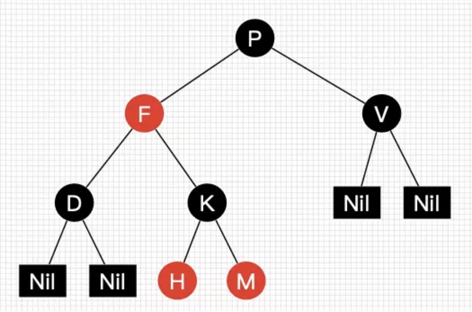
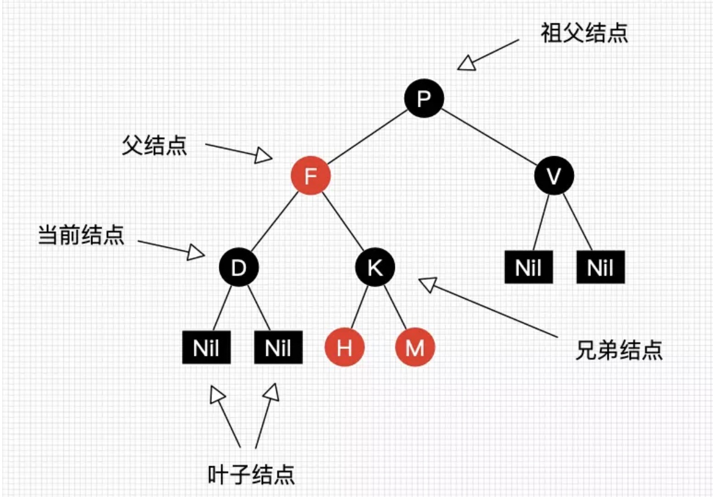
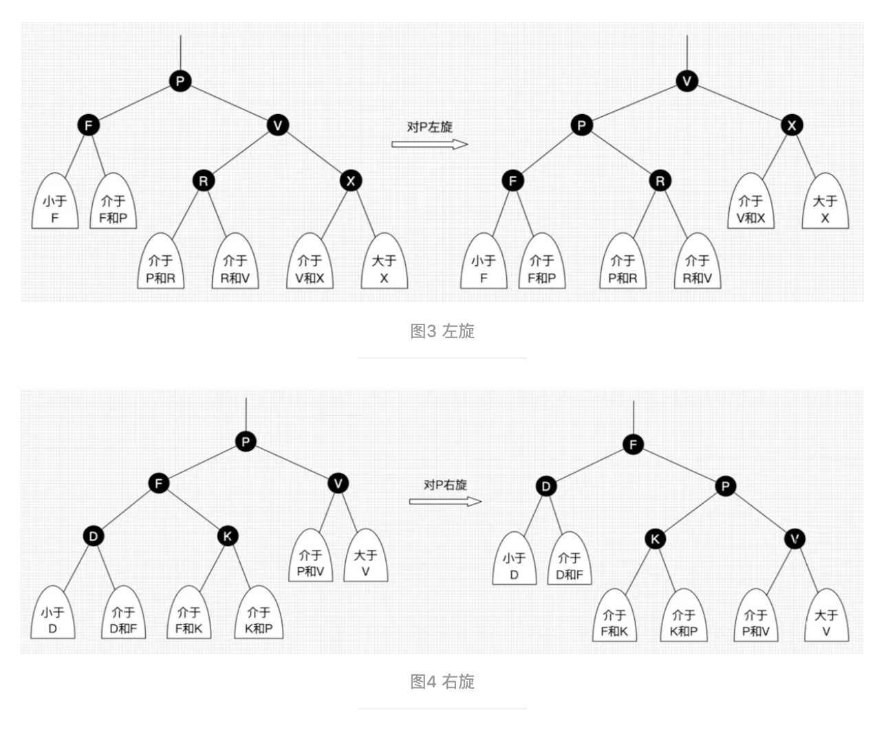

## 数据结构基本概念

#### (1)线性表

线性表又分为：顺序存储、链式存储

##### 顺序存储-----顺序表

一个线性表是n个具有相同特性的数据元素的有限序列。数据元素是一个抽象的符号，其具体含义在不同的情况下一般不同。

数组的特点是：寻址容易，插入和删除困难；

##### 链式存储----（单链表、双链表、循环链表）->指针实现、静态链表->数组实现

链表里面节点的地址不是连续的，是通过指针连起来的。

链表的特点是：寻址困难，插入和删除容易。

#### (2)哈希表

**哈希表hashtable(key，value) 就是把Key通过一个固定的算法函数既所谓的哈希函数转换成一个整型数字，然后就将该数字对数组长度进行取余，取余结果就当作数组的下标，将value存储在以该数字为下标的数组空间里。**

接下来解释的是最常用的一种方法——拉链法，我们可以理解为“链表的数组”，如图：


左边很明显是个数组，数组的每个成员包括一个指针，指向一个链表的头，当然这个链表可能为空，也可能元素很多。我们根据元素的一些特征把元素分配到不同的链表中去，也是根据这些特征，找到正确的链表，再从链表中找出这个元素。

Hash 表的查询速度非常的快，几乎是O(1)的时间复杂度。

hash就是找到一种数据内容和数据存放地址之间的映射关系。

hash表的运行过程

1、散列表的查找步骤 （散列法：元素特征转变为数组下标的方法）

当存储记录时，通过散列函数计算出记录的散列地址

当查找记录时，我们通过同样的是散列函数计算记录的散列地址，并按此散列地址访问该记录

2、如果两个字符串在哈希表中对应的位置相同，哈希表的每个入口挂一个链表，保存所有对应的字符串

#### 优缺点

- 优点：不论哈希表中有多少数据，查找、插入、删除（有时包括删除）只需要接近常量的时间即0(1）的时间级。实际上，这只需要几条机器指令。哈希表运算得非常快，在计算机程序中，如果需要在一秒种内查找上千条记录通常使用哈希表（例如拼写检查器)哈希表的速度明显比树快，树的操作通常需要O(N)的时间级。哈希表不仅速度快，编程实现也相对容易。如果不需要有序遍历数据，并且可以提前预测数据量的大小。那么哈希表在速度和易用性方面是无与伦比的。

- 缺点：它是基于数组的，数组创建后难于扩展，某些哈希表被基本填满时，性能下降得非常严重，所以程序员必须要清楚表中将要存储多少数据（或者准备好定期地把数据转移到更大的哈希表中，这是个费时的过程）。

**哈希表的原理：**

　　 1，对对象元素中的关键字(对象中的特有数据)，进行哈希算法的运算，并得出一个具体的算法值，这个值 称为**哈希值**。

　　2，哈希值就是这个元素的位置。

　　3，如果哈希值出现冲突，再次判断这个关键字对应的对象是否相同。如果对象相同，就不存储，因为元素重复。如果对象不同，就存储，在原来对象的哈希值基础 +1顺延。

　　4，存储哈希值的结构，我们称为哈希表。

　　5，既然哈希表是根据哈希值存储的，为了提高效率，最好保证对象的关键字是唯一的。

　　这样可以尽量少的判断关键字对应的对象是否相同，提高了哈希表的操作效率。

**扩展:**

相同的字符串如果存进去，**哈希值相同**并且**equals方法为true**，不会存入相同的

只要哈希值相同或者equals方法为true都成立才不会存入，**只要其中一条不满足，都会储存**

**哈希表存储过程：**

1.调用对象的哈希值(通过一个函数f()得到哈希值):**存储位置** **= f(关键字)**

2.集合在容器内搜索有没有重复的哈希值，如果没有，存入新元素，记录哈希值

3.再次存储，重复上边的过程

4.如果有重复的哈希值，调用后来者的equals方法，参数为前来者，结果得到true，集合判断为重复元素，不存入

**哈希冲突**

如果两个不同的元素，通过哈希函数得出的实际存储地址相同怎么办？也就是说，当我们对某个元素进行哈希运算，得到一个存储地址，然后要进行插入的时候，发现已经被其他元素占用了，其实这就是所谓的**哈希冲突**，也叫哈希碰撞。前面我们提到过，哈希函数的设计至关重要，好的哈希函数会尽可能地保证 **计算简单**和**散列地址分布均匀****,**但是，我们需要清楚的是，数组是一块连续的**固定长度**的内存空间，再好的哈希函数也不能保证得到的存储地址绝对不发生冲突。那么哈希冲突如何解决呢？

**哈希冲突的解决方案有多种：**

开放定址法（发生冲突，继续寻找下一块未被占用的存储地址）

再散列函数法

链地址法，而**HashMap**即是采用了链地址法，也就是**数组****+链表**的方式

**关于hashcode和equals的一些问题，在面试中会问道：**

1.两个对象哈希值相同，那么equals方法一定返回true吗？

**不一定:**取决于如何重写equals，如果重写固定了它返回false，结果就一定是false

2.equals方法返回true，那么哈希值一定相同吗？

equals返回为true,则两者的hashcode一定相等，意即相等的对象必须具有相等的[哈希码](https://www.baidu.com/s?wd=哈希码&tn=44039180_cpr&fenlei=mv6quAkxTZn0IZRqIHckPjm4nH00T1d9ujb3nvcYuW-Wn1RdrHP90ZwV5Hcvrjm3rH6sPfKWUMw85HfYnjn4nH6sgvPsT6KdThsqpZwYTjCEQLGCpyw9Uz4Bmy-bIi4WUvYETgN-TLwGUv3EnHTdn1Tvnj0YPHDsPWDvrjD3r0)。每当equals方法被覆写，通常需要重写hashCode方法从而保持对象行为的一致性。

### (3)数组

采用一段连续的存储单元来存储数据。对于指定下标的查找，时间复杂度为O(1)；通过给定值进行查找，需要遍历数组，逐一比对给定关键字和数组元素，时间复杂度为O(n)，当然，对于有序数组，则可采用二分查找，插值查找，斐波那契查找等方式，可将查找复杂度提高为O(logn)；对于一般的插入删除操作，涉及到数组元素的移动，其平均复杂度也为O(n) 

### (4)区别

**1.数组**

**优点：(1)随机访问效率高(根据下标查询)，(2)搜索效率较高(可使用折半方法)。**

**缺点：(1)内存连续且固定，存储效率低。(2)插入和删除效率低(可能会进行数组拷贝或扩容)。**

**2.链表**

**优点：(1)不要求连续内存，内存利用率高，(2)插入和删除效率高(只需要改变指针指向)。**

**缺点：(1)不支持随机访问，(2)搜索效率低(需要遍历)。**

**3.Hash表**

**优点：(1)搜索效率高，(2)插入和删除效率较高，**

**缺点：(1)内存利用率低(基于数组)，(2)存在散列冲突。**


# 集合类种重要概念词解释

#### **(1).泛型**

java中很重要的概念, 集合里面应用很多.

集合的元素，可以是任意类型对象的引用，如果把某个对象放入集合，则会忽略它的类型，就会把它当做Object类型处理.

泛型则是规定了某个集合只可以存放特定类型的对象的引用，会在编译期间进行类型检查,可以直接指定类型来获取集合元素

在泛型集合中有能够存入泛型类型的对象实例还可以存入泛型的子类型的对象实例

**注意：**

1 泛型集合中的限定类型，不能使用基本数据类型 即存储的要求是对象咯

2 可以通过使用包装类（Integer...）限定允许存放基本数据类型

**泛型的好处**

1 提高了安全性（将运行期的错误转换到编译期）

2 省去强转的麻烦

#### **(2).哈希值**

1 就是一个十进制的整数，有操作系统随机给出

2 可以使用Object类中的方法hashCode获取哈希值

3 Object中源码: **int hashCode()**返回该对象的哈希码值；

源码：

**public native int hashCode();**

**native**:指调用了本地操作系统的方法实

#### **(3).平衡二叉树(称AVL树)**

其特点是一棵空树或它的左右两个子树的高度差的绝对值不超过1，并且左右两个子树都是一棵平衡二叉树。也就是说该二叉树的任何一个子节点，其左右子树的高度都相近。

注意:

关键点是左子树和右子树的深度的绝对值不超过1

**那什么是左子树深度和右子树深度呢?**


如上图中:

如果插入6元素, 则8的左子树深度就为2, 右子树深度就为0,绝对值就为2, 就不是一个平很二叉树

#### **[1].二叉排序树**（leetcode写算法题的时候碰过）

1若左子树不空，则左子树上所有结点的值均小于它的根结点的值；

2若右子树不空，则右子树上所有结点的值均大于它的根结点的值；

3左、右子树也分别为二叉排序树

## **(4).红黑树**

红黑树（Red Black Tree） 是一种自平衡二叉查找树

(1) 检索效率O(log *n*)

(2) 红黑树的五点规定：

1.每个结点要么是红的要么是黑的

2.根结点是黑的

3.每个叶结点（叶结点即指树尾端NIL指针或NULL结点）都是黑的

4.如果一个结点是红的，那么它的两个儿子都是黑的**（反之不一定）**

5.对于任意结点而言，其到叶结点树尾端NIL指针的每条路径都包含相同数目的黑结点

它的每个结点都额外有一个颜色的属性，颜色只有两种：红色和黑色。

示例:(这块难度比较大, 建议自行百度,查阅相关文档)

##### 红黑树是一种含有红黑结点并能自平衡的二叉查找树。它必须满足下面性质：

- 性质1：每个节点要么是黑色，要么是红色。
- 性质2：根节点是黑色。
- 性质3：每个叶子节点（NIL）是黑色。
- 性质4：每个红色结点的两个子结点一定都是黑色。
- **性质5：任意一结点到每个叶子结点的路径都包含数量相同的黑结点。**
  从性质5又可以推出：
  - 性质5.1：如果一个结点存在黑子结点，那么该结点肯定有两个子结点

图1就是一颗简单的红黑树。其中Nil为叶子结点，并且它是黑色的。(值得提醒注意的是，在Java中，叶子结点是为null的结点。)



红黑树并不是一个*完美*平衡二叉查找树，从图1可以看到，根结点P的左子树显然比右子树高，但左子树和右子树的黑结点的层数是相等的，也即任意一个结点到到每个叶子结点的路径都包含数量相同的黑结点(性质5)。所以我们叫红黑树这种平衡为**黑色完美平衡**。

介绍到此，为了后面讲解不至于混淆，我们还需要来约定下红黑树一些结点的叫法，如图2所示。



我们把正在处理(遍历)的结点叫做当前结点，如图2中的D，它的父亲叫做父结点，它的父亲的另外一个子结点叫做兄弟结点，父亲的父亲叫做祖父结点。

前面讲到红黑树能自平衡，它靠的是什么？三种操作：左旋、右旋和变色。

- **左旋**：以某个结点作为支点(旋转结点)，其右子结点变为旋转结点的父结点，右子结点的左子结点变为旋转结点的右子结点，左子结点保持不变。如图3。
- **右旋**：以某个结点作为支点(旋转结点)，其左子结点变为旋转结点的父结点，左子结点的右子结点变为旋转结点的左子结点，右子结点保持不变。如图4。
- **变色**：结点的颜色由红变黑或由黑变红。



上面所说的旋转结点也即旋转的支点，图4和图5中的P结点。
 我们先忽略颜色，可以看到旋转操作不会影响旋转结点的父结点，父结点以上的结构还是保持不变的。
 **左旋**只影响旋转结点和其**右子树**的结构，把右子树的结点往左子树挪了。
 **右旋**只影响旋转结点和其**左子树**的结构，把左子树的结点往右子树挪了。

所以旋转操作是**局部**的。另外可以看出旋转能保持红黑树平衡的一些端详了：当一边子树的结点少了，那么向另外一边子树“借”一些结点；当一边子树的结点多了，那么向另外一边子树“租”一些结点。

但要保持红黑树的性质，结点不能乱挪，还得靠变色了。怎么变？具体情景又不同变法，后面会具体讲到，现在只需要记住**红黑树总是通过旋转和变色达到自平衡**。

balabala了这么多，相信你对红黑树有一定印象了，那么现在来考考你：

***思考题1：黑结点可以同时包含一个红子结点和一个黑子结点吗？\*** (答案见文末)

接下来先讲解红黑树的查找热热身。

#### 红黑树查找

因为红黑树是一颗二叉平衡树，并且查找不会破坏树的平衡，所以查找跟二叉平衡树的查找无异：

1. 从根结点开始查找，把根结点设置为当前结点；
2. 若当前结点为空，返回null；
3. 若当前结点不为空，用当前结点的key跟查找key作比较；
4. 若当前结点key等于查找key，那么该key就是查找目标，返回当前结点；
5. 若当前结点key大于查找key，把当前结点的左子结点设置为当前结点，重复步骤2；
6. 若当前结点key小于查找key，把当前结点的右子结点设置为当前结点，重复步骤2；


ok，插入位置已经找到，把插入结点放到正确的位置就可以啦，但插入结点是应该是什么颜色呢？答案是**红色**。理由很简单，红色在父结点（如果存在）为黑色结点时，红黑树的黑色平衡没被破坏，不需要做自平衡操作。但如果插入结点是黑色，那么插入位置所在的子树黑色结点总是多1，必须做自平衡。


## 基本的排序算法

### 1.冒泡排序

- 基本思想: 冒泡排序，类似于水中冒泡，较大的数沉下去，**较小的数慢慢冒起来**，假设从小到大，即为较大的数慢慢往后排，较小的数慢慢往前排。

**算法的描述：**

> 比较相邻的元素，然后如果左边大于右边则交换位置。（相当于每次循环都把最大的数一到数组后面）

**复杂度：**

> 时间复杂度：O(N²)   (两个嵌套循环)
>
> 空间复杂度：O(1)   

**代码：**

```java
//1.冒泡排序
    public static void bubbleSort(int[] a) {
        int len = a.length;
        int temp = 0;
        for (int i = 0; i < len - 1; i++) {
            for (int j = 0; j < len - i - 1; j++) {
                if (a[j + 1] < a[j]) {
                    temp = a[j + 1];
                    a[j + 1] = a[j];
                    a[j] = temp;
                }
            }
        }
    }
```

### 2.插入排序

- 基本思想: 将数组的第一个数认为是有序数组，从后往前扫描该有序数组，把数组中其余n-1个数，根据数值的大小，插入到有序数组中，直至数组中的所有数有序排列为止。这样的话，n个元素需要进行n-1趟排序！！！

**算法的描述：**

> 每一次把数组中一个数与有序数组进行从后往前一一比较，遇到比有序数组中元素小然后插入。

**复杂度：**

> 时间复杂度：O(N²)   
>
> 空间复杂度：O(1)   

**代码：**

```java
//4.插入排序
    public static void insertionSort(int arr[]) {
        //插入排序
        for (int i = 1; i < arr.length; i++) {
            //外层循环，从第二个开始比较
            for (int j = i; j > 0; j--) {
                //内存循环，与前面排好序的数据比较，如果后面的数据小于前面的则交换
                if (arr[j] < arr[j - 1]) {
                    int temp = arr[j - 1];
                    arr[j - 1] = arr[j];
                    arr[j] = temp;
                } else {
                    //如果不小于，说明插入完毕，退出内层循环
                    break;
                }
            }
        }
    }
```


### 3.选择排序

基本思想：选择排序，从头至尾扫描序列，找出最小的一个元素，和第一个元素交换，接着从剩下的元素中继续这种选择和交换方式，最终得到一个有序序列。

**算法的描述：**

> 每一次把数组中一个数与有序数组进行从后往前一一比较，遇到比有序数组中元素小然后插入。

**复杂度：**

> 时间复杂度：O(N²)   
>
> 空间复杂度：O(1)  

**代码：**

```java
    public static void selectSort(int arr[]) {
        for (int i = 0; i < arr.length; i++) {
            //默认第一个是最小的。
            int min = arr[i];
            //记录最小的下标
            int index = i;
            //通过与后面的数据进行比较得出，最小值和下标
            for (int j = i + 1; j < arr.length; j++) {
                if (min > arr[j]) {
                    min = arr[j];
                    index = j;
                }
            }
            //然后将最小值与本次循环的，开始值交换
            int temp = arr[i];
            arr[i] = min;
            arr[index] = temp;
            //说明：将i前面的数据看成一个排好的队列，i后面的看成一个无序队列。每次只需要找无需的最小值，做替换
        }
    }
```


### 4.快速排序

- 基本思想：1、先从数组中取出一个数作为基准数 2、将比这个数大的放在它右边，小于或者等于这个数的放在左边 3、再对左右区间重复第二步，直到各个区间只有一个数字

**算法的描述：**

> 用到了分治的思想，以一个数为基准，把数组分为一边大、一边小，然后再分别对左、右两个数组进行相同操作，直到子数组为1。

**例子：**

由于该算法比较晦涩难懂，举例子来说明一下算法过程（先简单查阅下面代码再来一一对应例子的步骤比较好理解）。

index： 0 1 2 3 4 5 6 7 8 9

数组：   6 1 2 5 9 3 4 7 10 8

step1）取6为基准值。然后从右寻找比6小的值 j=6,然后右往左找比6大的值 i=4

   此时交换：数组转变成 6 1 2 5 **4** 3 **9** 10 8 i=4 j=6

Step2) 继续以6位基准值，从j=6处向右寻找比6小的值，j=5，从i=4处向左找大于等于6的值i=5 此时i==j不进行元素交换，直接跳出循环将基准值与i坐标的值调转。

此时数组转变为：3 1 2 5 4 6 9 10 8

Step3)此时呢就把数组分为一边比6大 一边比6小了 随后分别对{3,1,2,5,4} {9,10,8}继续执行快排算法

Step4)由于算法都是一样，我选择比较短的{9,10,8}来演示快排函数最后的收尾部分

 数组：9 10 8。取9为基准值，那么老套路 j=2    i=1 

交换数组变为：9 8 10    j=2 i=1。老套路  j=1  i=1 由于i==j不交换 退出主循环

则i与left的值交换 变为 9 8 10

然后对 {9} {10}进行快排，此时数组中元素只有一个就退出了  

到此为止排序就完成了。

**复杂度：**

>平均时间复杂度：O(nlogn)

**代码：**

```java
//2.快排
    public static void quickSort(int[] num, int left, int right) {
        if (left >= right) {
            return;
        }
        //设置最左边的元素为基准值
        int key = num[left];
        //数组中比key小的放在左边，比key大的放在右边，key值下标为i
        int i = left;
        int j = right;
        while (i < j) {
            //j向左移，直到遇到比key小的值
            while (num[j] >= key && i < j) {
                j--;
            }
            //i向右移，直到遇到比key大的值
            while (num[i] <= key && i < j) {
                i++;
            }
            //i和j指向的元素交换
            if (i < j) {
                int temp = num[i];
                num[i] = num[j];
                num[j] = temp;
            }
        }
      	//i指向的元素与基准值进行交换
        num[left] = num[i];
        num[i] = key;
        quickSort(num, left, i - 1);
        quickSort(num, i + 1, right);
    }
```


### 5.归并排序

参考：https://www.cnblogs.com/chengxiao/p/6194356.html

- 基本思想：与快速排序一样，归并排序也是基于分治法的。归并排序将待排序的元素序列分成两个长度相等的子序列，为每一个子序列排序，然后再将他们合并成一个子序列。合并两个子序列的过程也就是两路归并。

**算法的描述：**

> 用到了分治的思想，主要的难度集中在归并上，其实就是两个数组通过下标来进行比较，由于都是排好序的两个数组，所以比较的时候就有规律可循，文字解释挺难的，我从参考博客那里取了栗子图，结合代码看一下就基本了解了

**复杂度：**

> 时间复杂度：O( nlogn )
> 与快排速度相同，但是比快排稳定，快排是平均时间复杂度为O(nlogn)
>

**例子：**

**分而治之**


**合并相邻有序子序列**


**个人理解：**

归并算法的主要难点集中在归并函数中，此函数需要将两个排好序或者单个元素的数组进行合并。从上方图片已经可以知道排好序的两个数组比较 只需要从两个数组的头开始比较，谁小谁就放入辅助数组之中，但左右其中一个数组越界之后，另一个数组必然会存在一个以上元素为放入辅助数组中，未放入代表着他已经比另外一个数组的所以元素都大了，而由于两个数组都是排好序了，所以此时将下标未越界的数组中所有元素有序的插入到辅助数组中即可。

**代码：**

```java
//5.归并排序
    //两路归并算法，两个排好序的子序列合并为一个子序列
    public static void merge(int[] a, int left, int mid, int right) {
        int[] tmp = new int[a.length];//辅助数组
        int p1 = left, p2 = mid + 1, k = left;//p1、p2是检测指针，k是存放指针
        while (p1 <= mid && p2 <= right) { //左右两个数组的下表界限
            if (a[p1] <= a[p2]) //其实就是两个排好序的数组分别从最小数字开始比较，谁最小就放入辅助数组中
                tmp[k++] = a[p1++];
            else
                tmp[k++] = a[p2++];
        }

        while (p1 <= mid) tmp[k++] = a[p1++];//如果第一个序列未检测完，直接将后面所有元素加到合并的序列中
        while (p2 <= right) tmp[k++] = a[p2++];//同上

        //复制回原素组
        for (int i = left; i <= right; i++)
            a[i] = tmp[i];
    }
    public static void mergeSort(int[] a, int start, int end) {
        if (start < end) {//当子序列中只有一个元素时结束递归
            int mid = (start + end) / 2;//划分子序列
            mergeSort(a, start, mid);//对左侧子序列进行递归排序
            mergeSort(a, mid + 1, end);//对右侧子序列进行递归排序
            merge(a, start, mid, end);//合并
        }
    }
```

最终5个基本的排序算法的代码：

```java
package com.awakeyo.Sort;

import java.util.Arrays;
import java.util.Date;

/**
 * @author awakeyoyoyo
 * @className Solution
 * @description TODO
 * @date 2020-03-31 22:44
 */
public class Solution {
    //1.冒泡排序
    public static void bubbleSort(int[] a) {
        int len = a.length;
        int temp = 0;
        for (int i = 0; i < len - 1; i++) {
            for (int j = 0; j < len - i - 1; j++) {
                if (a[j + 1] < a[j]) {
                    temp = a[j + 1];
                    a[j + 1] = a[j];
                    a[j] = temp;
                }
            }
        }
    }
    //2.快排
    public static void quickSort(int[] num, int left, int right) {
        if (left >= right) {
            return;
        }
        //设置最左边的元素为基准值
        int key = num[left];
        //数组中比key小的放在左边，比key大的放在右边，key值下标为i
        int i = left;
        int j = right;
        while (i < j) {
            //j向左移，直到遇到比key小的值
            while (num[j] >= key && i < j) {
                j--;
            }
            //i向右移，直到遇到比key大的值
            while (num[i] <= key && i < j) {
                i++;
            }
            //i和j指向的元素交换
            if (i < j) {
                int temp = num[i];
                num[i] = num[j];
                num[j] = temp;
            }
        }
        num[left] = num[i];
        num[i] = key;
        quickSort(num, left, i - 1);
        quickSort(num, i + 1, right);
    }
    //3.选择排序
    public static void selectSort(int arr[]) {
        for (int i = 0; i < arr.length; i++) {
            //默认第一个是最小的。
            int min = arr[i];
            //记录最小的下标
            int index = i;
            //通过与后面的数据进行比较得出，最小值和下标
            for (int j = i + 1; j < arr.length; j++) {
                if (min > arr[j]) {
                    min = arr[j];
                    index = j;
                }
            }
            //然后将最小值与本次循环的，开始值交换
            int temp = arr[i];
            arr[i] = min;
            arr[index] = temp;
            //说明：将i前面的数据看成一个排好的队列，i后面的看成一个无序队列。每次只需要找无需的最小值，做替换
        }
    }
    //4.插入排序
    public static void insertionSort(int arr[]) {
        //插入排序
        for (int i = 1; i < arr.length; i++) {
            //外层循环，从第二个开始比较
            for (int j = i; j > 0; j--) {
                //内存循环，与前面排好序的数据比较，如果后面的数据小于前面的则交换
                if (arr[j] < arr[j - 1]) {
                    int temp = arr[j - 1];
                    arr[j - 1] = arr[j];
                    arr[j] = temp;
                } else {
                    //如果不小于，说明插入完毕，退出内层循环
                    break;
                }
            }
        }
    }
    //5.归并排序
    //两路归并算法，两个排好序的子序列合并为一个子序列
    public static void merge(int[] a, int left, int mid, int right) {
        int[] tmp = new int[a.length];//辅助数组
        int p1 = left, p2 = mid + 1, k = left;//p1、p2是检测指针，k是存放指针

        while (p1 <= mid && p2 <= right) {
            if (a[p1] <= a[p2])
                tmp[k++] = a[p1++];
            else
                tmp[k++] = a[p2++];
        }

        while (p1 <= mid) tmp[k++] = a[p1++];//如果第一个序列未检测完，直接将后面所有元素加到合并的序列中
        while (p2 <= right) tmp[k++] = a[p2++];//同上

        //复制回原素组
        for (int i = left; i <= right; i++)
            a[i] = tmp[i];
    }
    public static void mergeSort(int[] a, int start, int end) {
        if (start < end) {//当子序列中只有一个元素时结束递归
            int mid = (start + end) / 2;//划分子序列
            mergeSort(a, start, mid);//对左侧子序列进行递归排序
            mergeSort(a, mid + 1, end);//对右侧子序列进行递归排序
            merge(a, start, mid, end);//合并
        }
    }
    //测试函数
    public static void main(String[] args) {
        int[] nums1 = {5, 2, 3, 1};
        int[] nums2 = {5, 1, 1, 2, 0, 0};
//        quickSort(nums1, 0, nums1.length-1);
//        quickSort(nums2, 0, nums2.length-1);
//        selectSort(nums1);
//        selectSort(nums2);
//        insertionSort(nums1);
//        insertionSort(nums2);
        mergeSort(nums1, 0, nums1.length - 1);
        mergeSort(nums2, 0, nums1.length - 1);
        Arrays.stream(nums1).forEach(System.out::print);
        System.out.println("\n################");
        Arrays.stream(nums2).forEach(System.out::print);
    }
}

```

