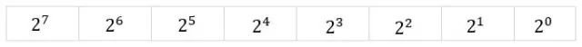
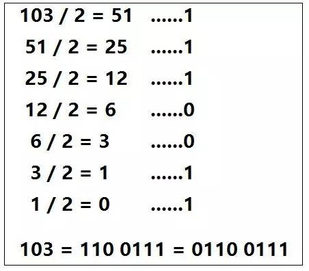

# 基础知识


## 位运算总结：

## 基础热身

#### 一、二进制

1.1 二进制是计算机采用的表示数字的方式, 每个数位上只有0和1；

1.2 任何整数一定可以采用二进制的方式表示, 小数的二进制这里不多说；

1.3 字节内部采用二进制方式记录数字, 一个字节分成八段, 每个分段有一个编号, 最右边分段编号是0, 向左逐渐递增

1.4 相邻分段之间有2倍关系, 某个分段的数字相当于2的编号次方, 如下



**二进制转十进制：**

把每个数位单独转换后把所有的转换结果求和

例：01001110 = 2^6 + 2^3 + 2^2 + 2^1 = 64 + 8 + 4 + 2 = 78



计算机字节里采用二进制补码记录数字

所有非负数整数, 补码和原码一样

# 原码、反码、补码

### 1. 原码

原码就是符号位加上真值的绝对值, 即用第一位表示符号, 其余位表示值. 比如如果是8位二进制:

> [+1]原 = 0000 0001
>
> [-1]原 = 1000 0001

第一位是符号位. 因为第一位是符号位, 所以8位二进制数的取值范围就是:

> [1111 1111 , 0111 1111]

即

> [-127 , 127]

原码是人脑最容易理解和计算的表示方式.

### 2. 反码

反码的表示方法是:

正数的反码是其本身

负数的反码是在其原码的基础上, 符号位不变，其余各个位取反.

> [+1] = [00000001]原 = [00000001]反
>
> [-1] = [10000001]原 = [11111110]反

可见如果一个反码表示的是负数, 人脑无法直观的看出来它的数值. 通常要将其转换成原码再计算.

### 3. 补码

补码的表示方法是:

正数的补码就是其本身

负数的补码是在其原码的基础上, 符号位不变, 其余各位取反, 最后+1. (即在反码的基础上+1)

> [+1] = [00000001]原 = [00000001]反 = [00000001]补
>
> [-1] = [10000001]原 = [11111110]反 = [11111111]补

对于负数, 补码表示方式也是人脑无法直观看出其数值的. 通常也需要转换成原码在计算其数值.

可见原码, 反码和补码是完全不同的. 既然原码才是被人脑直接识别并用于计算表示方式, 为何还会有反码和补码呢?

首先, 因为人脑可以知道第一位是符号位, 在计算的时候我们会根据符号位, 选择对真值区域的加减. (真值的概念在本文最开头). 但是对于计算机, 加减乘数已经是最基础的运算, 要设计的尽量简单. 计算机辨别"符号位"显然会让计算机的基础电路设计变得十分复杂! 于是人们想出了将符号位也参与运算的方法. 我们知道, 根据运算法则减去一个正数等于加上一个负数, 即: 1-1 = 1 + (-1) = 0 , 所以机器可以只有加法而没有减法, 这样计算机运算的设计就更简单了.

于是人们开始探索 将符号位参与运算, 并且只保留加法的方法. 首先来看原码:

计算十进制的表达式: 1-1=0

> 1 - 1 = 1 + (-1) = [00000001]原 + [10000001]原 = [10000010]原 = -2

如果用原码表示, 让符号位也参与计算, 显然对于减法来说, 结果是不正确的.这也就是为何计算机内部不使用原码表示一个数.

为了解决原码做减法的问题, 出现了反码:

计算十进制的表达式: 1-1=0

> 1 - 1 = 1 + (-1) = [0000 0001]原 + [1000 0001]原= [0000 0001]反 + [1111 1110]反 = [1111 1111]反 = [1000 0000]原 = -0

发现用反码计算减法, 结果的真值部分是正确的. 而唯一的问题其实就出现在"0"这个特殊的数值上. **虽然人们理解上+0和-0是一样的, 但是0带符号是没有任何意义的. 而且会有[0000 0000]原和[1000 0000]原两个编码表示0.**

于是补码的出现, 解决了0的符号以及两个编码的问题:

> 1-1 = 1 + (-1) = [0000 0001]原 + [1000 0001]原 = [0000 0001]补 + [1111 1111]补 = [0000 0000]补=[0000 0000]原

这样0用[0000 0000]表示, 而以前出现问题的-0则不存在了.而且可以用[1000 0000]表示-128:

> (-1) + (-127) = [1000 0001]原 + [1111 1111]原 = [1111 1111]补 + [1000 0001]补 = [1000 0000]补

-1-127的结果应该是-128, 在用补码运算的结果中, [1000 0000]补 就是-128. 但是注意因为实际上是使用以前的-0的补码来表示-128, 所以-128并没有原码和反码表示.(对-128的补码表示[1000 0000]补算出来的原码是[0000 0000]原, 这是不正确的)

使用补码, 不仅仅修复了0的符号以及存在两个编码的问题, 而且还能够多表示一个最低数. 这就是为什么8位二进制, 使用原码或反码表示的范围为[-127, +127], 而使用补码表示的范围为[-128, 127].

因为机器使用补码, 所以对于编程中常用到的32位int类型, 可以表示范围是: [-231, 231-1] 因为第一位表示的是符号位.而使用补码表示时又可以多保存一个最小值.

## 1.位运算概述

从现代计算机中所有的数据二进制的形式存储在设备中。即0、1两种状态，计算机对二进制数据进行的运算(+、-、*、/)都是叫位运算，即将符号位共同参与运算的运算。

看例子吧直接：

```
int a = 35;
int b = 47;
int c = a + b;
```

计算两个数的和，因为在计算机中都是以二进制来进行运算，所以上面我们所给的int变量会在机器内部先转换为二进制在进行相加：

```
35:  0 0 1 0 0 0 1 1
47:  0 0 1 0 1 1 1 1
————————————————————
82:  0 1 0 1 0 0 1 0
```

所以，相比在代码中直接使用(+、-、*、/)运算符，合理的运用位运算更能显著提高代码在机器上的执行效率。

## 2.位运算概览

| 符号 | 描述 | 运算规则                                                     |
| ---- | ---- | :----------------------------------------------------------- |
| &    | 与   | 两个位都为1时，结果才为1                                     |
| \|   | 或   | 两个位都为0时，结果才为0                                     |
| ^    | 异或 | 两个位相同为0，相异为1                                       |
| ~    | 取反 | 0变1，1变0                                                   |
| <<   | 左移 | 各二进位全部左移若干位，高位丢弃，低位补0                    |
| >>   | 右移 | 各二进位全部右移若干位，对无符号数，高位补0，有符号数，各编译器处理方法不一样，有的补符号位（算术右移），有的补0（逻辑右移） |

## 3.按位与运算符（&）

定义：参加运算的两个数据，按二进制位进行“与”运算。

运算规则：

```
0&0=0  0&1=0  1&0=0  1&1=1
```

#### 总结：两位同时为**1**，结果才为**1**，否则结果为**0**。

例如：`3&5` 即 0000 0011& 0000 0101 = 0000 0001，因此 3&5 的值得1。

-3&5。 1000 0011&0000 0101 ->0111 1101&0000 0101=0000 0101=5

注意：负数按**补码**形式参加按位与运算。


与运算的用途：

**1）清零**

如果想将一个单元清零，即使其全部二进制位为0，只要与一个各位都为零的数值相与，结果为零。

**2）取一个数的指定位**

比如取数 X=1010 1110 的低4位，只需要另找一个数Y，令Y的低4位为1，其余位为0，即Y=0000 1111，然后将X与Y进行按位与运算（X&Y=0000 1110）即可得到X的指定位。

**3）判断奇偶**

只要根据最未位是0还是1来决定，为0就是偶数，为1就是奇数。因此可以用`if ((a & 1) == 0)`代替`if (a % 2 == 0)`来判断a是不是偶数。

## 4.按位或运算符（|）[ ](https://www.cnblogs.com/yueshutong/p/11244534.html#3267481343)

定义：参加运算的两个对象，按二进制位进行“或”运算。

运算规则：

```
0|0=0  0|1=1  1|0=1  1|1=1
```

#### 总结：参加运算的两个对象只要有一个为1，其值为1。

例如：`3|5`即 0000 0011| 0000 0101 = 0000 0111，因此，`3|5`的值得7。　

注意：负数按**补码**形式参加按位或运算。

或运算的用途：

**1）常用来对一个数据的某些位设置为1**

比如将数 X=1010 1110 的低4位设置为1，只需要另找一个数Y，令Y的低4位为1，其余位为0，即Y=0000 1111，然后将X与Y进行按位或运算（X|Y=1010 1111）即可得到。

## 5.异或运算符（^）[ ](https://www.cnblogs.com/yueshutong/p/11244534.html#4028003129)

定义：参加运算的两个数据，按二进制位进行“异或”运算。

运算规则：

```
0^0=0  0^1=1  1^0=1  1^1=0
```

#### 总结：参加运算的两个对象，如果两个相应位相同为0，相异为1。

异或的几条性质:

1、交换律

2、结合律 (a^b)^c == a^(b^c)

3、对于任何数x，都有 x^x=0，x^0=x

4、自反性: a^b^b=a^0=a;

异或运算的用途：

**1）翻转指定位**

比如将数 X=1010 1110 的低4位进行翻转，只需要另找一个数Y，令Y的低4位为1，其余位为0，即Y=0000 1111，然后将X与Y进行异或运算（X^Y=1010 0001）即可得到。

**2）与0相异或值不变**

例如：1010 1110 ^ 0000 0000 = 1010 1110

**3）交换两个数**

[](javascript:void(0);)

```
void Swap(int &a, int &b){
    if (a != b){
        a ^= b;
        b ^= a;
        a ^= b;
    }
}
// a=2,b=5 
a:0000 0010 b:0000 0101
//a=a^b=0000 0111=7
//b=b^a=0000 0010=2
//a=a^b=0000 0101=5
```

[](javascript:void(0);)

## 6.取反运算符 (~)[ ](https://www.cnblogs.com/yueshutong/p/11244534.html#909117224)

定义：参加运算的一个数据，按二进制进行“取反”运算。
运算规则：　

```
~1=0
~0=1
```

#### 总结：对一个二进制数按位取反，即将0变1，1变0。

异或运算的用途：

**1）使一个数的最低位为零**

使a的最低位为0，可以表示为：`a & ~1`。~1的值为 1111 1111 1111 1110，再按"与"运算，最低位一定为0。因为“ ~”运算符的优先级比算术运算符、关系运算符、逻辑运算符和其他运算符都高。

## 7.左移运算符（<<）[ ](https://www.cnblogs.com/yueshutong/p/11244534.html#1958716193)

定义：将一个运算对象的各二进制位全部左移若干位（左边的二进制位丢弃，右边补0）。

设 a=1010 1110，`a = a<< 2` 将a的二进制位左移2位、右补0，即得a=1011 1000。

若左移时舍弃的高位不包含1，则每左移一位，相当于该数乘以2。

## 8.右移运算符（>>）[ ](https://www.cnblogs.com/yueshutong/p/11244534.html#2076073887)

定义：将一个数的各二进制位全部右移若干位，正数左补0，负数左补1，右边丢弃。

例如：a=a>>2 将a的二进制位右移2位，左补0 或者 左补1得看被移数是正还是负。

操作数每右移一位，相当于该数除以2。